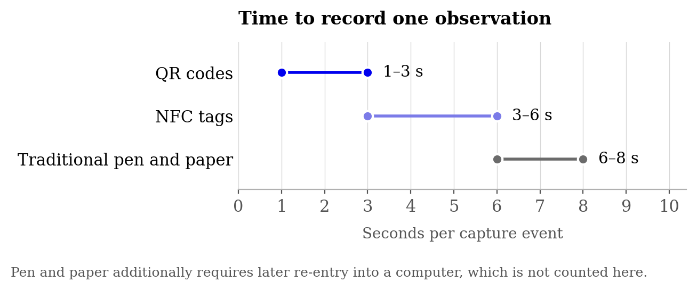
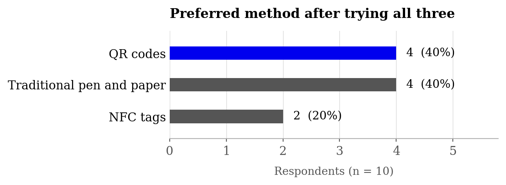

# QR and NFC data capture for clinical trials

A study of whether scanning a code beats writing on a clipboard when you are
recording dosing events in a trial, and a small offline web app that implements
the faster of the two.

My B.Pharm thesis, published 2023, at [Dr. D. Y. Patil College of Pharmacy,
Akurdi](https://www.dyppharmaakurdi.ac.in/), affiliated to [Savitribai Phule
Pune University](https://www.unipune.ac.in/).

**[Read the write-up →](https://falakpat3l.github.io/qr-nfc-clinical-trials/)** · **[Open the capture app →](https://falakpat3l.github.io/qr-nfc-clinical-trials/app.html)**

---

## The problem

Trial data still gets written on paper. The cost is not the writing: it is that
someone later has to type the same numbers into a computer a second time. That
second pass is where the hours and the transcription errors come from, and it is
invisible in any measurement that only times the original act of writing.

Both QR codes and NFC tags remove the second pass. You scan, and the record is
already structured and already timestamped. The question this repository answers
is how much that actually saves, and which of the two technologies is the better
bet.

## What I found

### Time to record one observation



| Method | Seconds per event | Needs later re-entry |
|---|---|---|
| QR codes | 1–3 | No |
| NFC tags | 3–6 | No |
| Traditional pen and paper | 6–8 | **Yes** |

QR scanning was roughly two to three times faster per event than writing by hand,
and NFC sat between the two. The re-entry column matters more than the seconds
column: the paper arm is the only one that incurs a whole second pass over every
record, so the real gap in total labour is wider than these numbers show. I did
not time the re-entry pass, so I am not going to put a figure on it.

### What people preferred after trying all three



Ten people doing pre-clinical research used all three methods and then chose one.

| Preference | Respondents | Share |
|---|---|---|
| QR codes | 4 | 40% |
| Traditional pen and paper | 4 | 40% |
| NFC tags | 2 | 20% |

**Preference split evenly between QR and paper.** This is the result people
usually skip past, and it is the most interesting one here: being measurably
faster did not make QR the preferred method. Four of ten still wanted the
clipboard. With n = 10 this is directional at best and carries no statistical
weight, but it points at something real: the barrier to electronic capture in
the animal house is habit and trust, not speed. Any rollout that assumes people
will switch because the stopwatch says so is going to be disappointed.

## QR or NFC?

They are not interchangeable, and the right answer depends on what the site
actually needs.

| | NFC tags | QR codes |
|---|---|---|
| **Mechanism** | Short-range radio between two devices | Two-dimensional barcode read by a camera |
| **Range** | A few centimetres: must be tapped | Readable at a distance, scaling with printed size |
| **Capacity** | Several kilobytes | A few hundred characters |
| **Security** | Harder to capture: proximity is required | Weaker: anything that can see it can copy it |
| **Cost** | Higher: each tag is a physical chip | Near zero: it prints on anything |
| **Device support** | Uneven, and absent on some phones | Any phone with a camera |
| **Duplication** | Hard, which is a feature for custody | Trivial, which is a hazard |

In practice QR won on speed, cost and the fact that it works on every phone
anyone brought. NFC's advantage is real but narrow: because a tag has to be
physically tapped, it is much harder to fabricate a reading you did not take. If
your risk is someone photographing a code and recording doses they never gave,
NFC is worth the money. Otherwise QR is the better default.

## What this does not show

- **Sample size.** Ten respondents, and three cages per arm. Everything here is
  directional. None of it is powered for a significance claim, and I have not
  made one.
- **Error rates were not quantified.** The argument that scanning reduces
  transcription error is mechanically sound (there is no transcription step
  to get wrong), but I did not measure error rates, so this repository does not
  report any.
- **Re-entry time was not measured**, only observed to exist.
- **The population was not representative.** Everyone involved was comfortable
  with a smartphone. The known failure mode for this kind of system is a user who
  is not, and that user was not in the sample.
- **Technical failure modes are under-explored.** Camera focus in low light, a
  dirty or curled label, a phone without NFC, a dead battery mid-round: each of
  these is a data loss event that paper does not have.
- **Privacy and custody.** A scannable code on a cage is readable by anyone who
  walks past it with a phone. Identifiers on a tag should be opaque, and the
  mapping held elsewhere. The app in this repository stores data only in your own
  browser and transmits nothing, which sidesteps the question rather than
  answering it.

## Where this should go next

1. **Standardise the payload.** The gain evaporates if every site invents its own
   encoding. What is needed is an agreed field set for a dosing event, so that a
   scanner from one group reads a label from another.
2. **Write into the record system directly.** Capture that terminates in a CSV on
   someone's laptop has moved the re-entry problem rather than removed it. The
   destination has to be the EDC or EHR.
3. **Personalise the label.** A code carrying subject, drug, dose and schedule can
   drive reminders and adherence checks, not just logging.
4. **Design for the uncomfortable user**, since that is where adoption actually
   fails.
5. **Look at BLE and RFID** where QR and NFC run out: longer range, no line of
   sight, bulk reads of a whole rack at once.

## The app

A single-page capture tool, in `docs/`. No build step, no server, no dependencies
beyond two vendored libraries. Open it and it works.

- **Generate**: turn a dosing record into a QR label you can print and attach.
- **Scan**: read a label with the device camera and log it, timestamped.
- **NFC**: read and write the same record to an NFC tag. Requires Web NFC, which
  today means Chrome on Android; elsewhere the tab explains why it is unavailable
  rather than silently failing.
- **Benchmark**: time yourself capturing events by each method and get your own
  version of the chart above, rather than trusting mine.
- **Log**: everything captured, exportable as CSV or JSON.

Records stay in your browser's local storage. Nothing is uploaded, and there is no
backend to upload to.

### Running it

```bash
git clone https://github.com/falakpat3l/qr-nfc-clinical-trials.git
cd qr-nfc-clinical-trials
python3 -m http.server 8000 --directory docs
```

Then open `http://localhost:8000`.

The camera and NFC both require a secure context, so they work on `localhost` and
over HTTPS, but not over plain HTTP from another machine. For phone testing, use
the GitHub Pages URL.

### Regenerating the analysis

```bash
python3 analysis/make_placeholder_data.py   # rebuild the per-event dataset
python3 analysis/make_figures.py            # rebuild both figures
```

Requires `matplotlib`.

### Tests

```bash
node test/roundtrip.js
```

No test framework and no install. It exercises the wire format against awkward
input (pipes inside values, quotes, non-ASCII, truncated and foreign
payloads), and then does the real thing: encodes an event, renders it to an actual QR
matrix, rasterises that to pixels, and decodes it back through the same scanner
the app uses. If a label can be generated but not read, this fails.

## The label format

`docs/codec.js` is the whole specification, and it is deliberately small:

```
CTDE1|subject|cage|drug|dose|unit|route|operator
```

Plain text rather than a URL, because a label that resolves to a server is
useless without signal and phones home for no reason. Pipe-delimited rather than
JSON, because at QR sizes the punctuation is a real cost. Every field is
percent-encoded, so a pipe inside a value cannot split the record. `CTDE1` is a
version marker, so a later `CTDE2` can change the field list without old and new
labels being confused.

This file is the part that would have to be agreed between sites for one group's
scanner to read another group's labels. That agreement, not the scanning, is the
hard part of the standardisation point above.

## Data

See [`data/README.md`](data/README.md) for the full provenance. In short: the
summary numbers in `user-acceptance.csv` and `capture-time-summary.csv` are what
was observed. The per-event file `capture-events.csv` is **synthetic**: the
original per-event readings were not retained, so it is generated to sit inside
the observed ranges purely so the analysis code can be run and reviewed. It is
labelled as such in a `data_origin` column on every row. Do not cite it as a
measurement.

## Repository layout

```
├── docs/              the site, served by GitHub Pages
│   ├── index.html     the write-up
│   ├── app.html       the capture tool
│   ├── app.js         UI, camera, NFC, benchmark, log
│   ├── codec.js       the CTDE1 wire format, standalone and testable
│   ├── style.css
│   ├── figures/
│   └── vendor/        jsQR (Apache-2.0), qrcode-generator (MIT)
├── data/              observed summaries + synthetic per-event data
├── analysis/          data generation and figure rendering
│   └── figures/
├── test/
│   └── roundtrip.js   encode → render → scan → decode, with no browser
├── LICENSE.md
└── README.md
```

## Licence

[PolyForm Noncommercial License 1.0.0](LICENSE.md). Free for research, teaching,
personal and public-sector use. Commercial use requires a separate licence:
contact me.

The two vendored libraries in `docs/vendor/` keep their own licences.

## Author

Falak Ameesh Patel, [falakpatel.com](https://falakpatel.com)

This work was my B.Pharm thesis, published 2023, at [Dr. D. Y. Patil College of
Pharmacy, Akurdi](https://www.dyppharmaakurdi.ac.in/), affiliated to
[Savitribai Phule Pune University](https://www.unipune.ac.in/).
